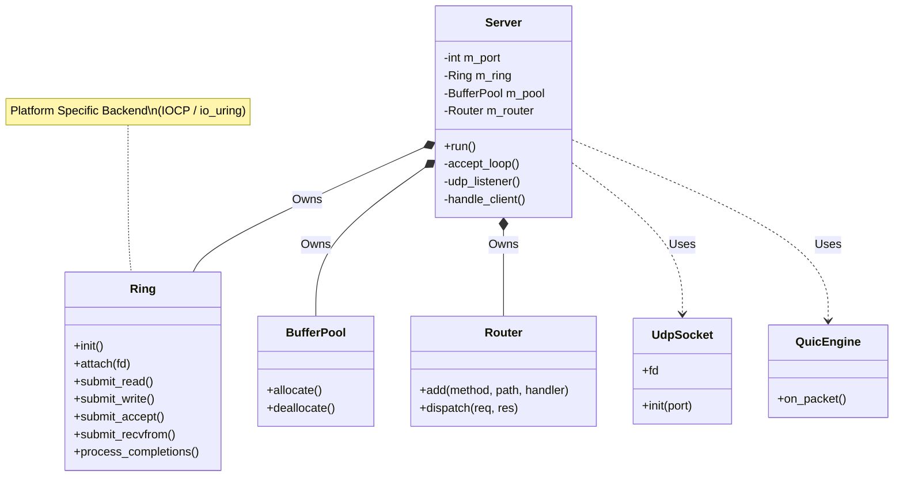

# DK Server Architecture

## High-Level Overview

The DK Server is a high-performance, asynchronous web server built with C++23. It uses a Proactor pattern with Coroutines to handle thousands of concurrent connections efficiently.

## Core Components

1.  **Server**: The main entry point. It initializes the `Ring` (Event Loop), `BufferPool` (Memory), and starts the TCP and UDP listeners.
2.  **Ring**: The abstraction layer for asynchronous I/O. It maps to `WindowsIOCP` on Windows and `LinuxUring` on Linux.
3.  **Coroutines**: All I/O operations (`async_read`, `async_write`, `async_accept`) are awaitable, allowing linear code style for asynchronous logic.
4.  **BufferPool**: A lock-free(ish) memory pool to reduce heap fragmentation and allocation overhead.
5.  **Router**: A simple regex/map based router for API endpoints.
6.  **QUIC/HTTP3**: A custom implementation of the QUIC transport and HTTP/3 framing layer.

## Flow

1.  `Server::run()` starts `accept_loop` (TCP) and `udp_listener` (UDP).
2.  **TCP**:
    *   `accept_loop` awaits `async_accept`.
    *   On connection, spawns `handle_client`.
    *   `handle_client` reads data, detects HTTP/1.1 or HTTP/2.
    *   If HTTP/1.1: Parses request, checks Router, or serves Static File (Zero-Copy).
    *   If HTTP/2: Passes data to `http2::Session`.
3.  **UDP**:
    *   `udp_listener` awaits `async_recvfrom`.
    *   On packet, passes to `quic::Engine`.
    *   `quic::Engine` parses packet, routes to `QuicSession`.
    *   `QuicSession` handles HTTP/3 frames.
